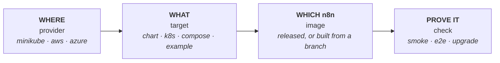

# 🧪 n8n hosting lab

**Deploy n8n the way the `n8n-hosting` files deploy it, on your laptop or a cloud, and prove it works.**

```bash
./lab up queue          # queue mode: main, workers, Postgres, Redis
./lab check --e2e       # health checks, then a real workflow run through a webhook
./lab down              # clean up
```

> **Throwaway by design.** Lab deployments use disposable storage, random secrets and ClusterIP services. They are for testing, never for production.

## Why

`n8n-hosting` ships a Helm chart, Kubernetes manifests, Compose stacks and chart examples. Each can break in ways a lint never shows: a pod that never becomes ready, a migration that fails on upgrade, a webhook processor that cannot reach Redis. The lab answers one question for any of them: **does this actually run?**

It deploys the files **as shipped** (never its own copy), on **real clusters**, and tests **behaviour**: pods ready, database reachable, a workflow runs, an upgrade keeps your data.

## Quick start

You need Node 24 or later, `kubectl`, `helm`, and minikube with Docker for the easy local setup.

```bash
cd tools/lab
pnpm install                    # once
./lab up single                 # one pod with SQLite: the smallest thing that runs
./lab check --e2e               # prove it works
./lab down                      # remove every deployment (the cluster stays)
```

`up` prints a `kubectl port-forward` line to open the editor. A missing tool stops the lab before it creates anything, with an install hint. `./lab --help` lists every command, target and setting.

| I want to... | Run |
| --- | --- |
| Test a Helm chart change | `HOSTING=<worktree> ./lab up queue` |
| Test the `kubernetes/` manifests | `./lab up k8s` |
| Test a Compose stack | `./lab up compose-with-postgres` |
| Test a chart example | `./lab up example-minimal` |
| Check an upgrade keeps working | `./lab upgrade queue --from 2.30.0` |
| Test an unreleased n8n branch | `./build-image.sh <n8n worktree> <name>`, then `N8N_IMAGE=n8n-<name> N8N_TAG=latest ./lab up k8s` |
| Run on a cloud | `./lab up queue --provider aws` (or `azure`) |
| Try an n8n setting or Helm values | `./lab up queue --env N8N_LOG_LEVEL=debug`, `--values my.yaml` |

## How it fits together

Every run is **four independent choices**. Change one without touching the others.



The lab is a small TypeScript CLI that drives `kubectl`, `helm`, `docker` and a cloud CLI. No server, no database, no build step. A provider only hands back a kube context, and everything after that is the same on every provider. The code layout and how to add a target, provider, check or command are in [AGENTS.md](AGENTS.md).

## Where it runs

| Provider | Needs | Cost | Notes |
| --- | --- | --- | --- |
| `minikube` (default) | `minikube`, `docker` | free | Runs every target. Wants 8 GiB or more |
| `aws` | `aws`, `eksctl` | about $0.20 an hour | EKS, 1 × t3.large. Chart and `k8s` targets |
| `azure` | `az` | about $0.08 an hour | AKS, 1 × Standard_B2ms. Chart and `k8s` targets |

A cloud cluster keeps costing until you delete it with `./lab cluster delete <name>`. `down` removes deployments only, `status` shows what a running cluster costs, and creating one always asks first. On a cloud, images must be in a registry: `./lab registry` creates one and prints where to push (`REGISTRY=<it> ./build-image.sh ...`).

## What it deploys

| Target | What it deploys |
| --- | --- |
| `single` | Helm chart, one pod, SQLite |
| `queue` | Helm chart, main, 2 workers, Postgres, Redis |
| `webhooks` | `queue` plus 2 webhook processors |
| `multimain` | `webhooks` plus multi-main (needs `N8N_LICENSE_KEY`) |
| `k8s` | the `kubernetes/` manifests, in namespace `lab-k8s` so a real install is never touched |
| `compose-with-postgres`, `compose-with-postgres-and-worker`, `compose-caddy`, `compose-subfolder-with-ssl` | the Compose stacks, run as shipped with a generated override (minikube provider only) |
| `example-<name>` | any file in `charts/n8n/examples/`, with random secrets and autoscalers off |

`./lab up` with no target runs `single queue webhooks multimain`. Name several to run them side by side.

## How it proves it works

`./lab check` smoke-tests every deployed target from inside its pods, so no port is published: pods ready, `/healthz`, `/healthz/readiness` (database reachable), the editor loads, the webhook route answers. Each check retries for about 20 seconds, and the command exits 1 on any failure.

`./lab check --e2e` also creates a webhook workflow, calls it, and checks the answer it computed. On `queue` that proves a worker really ran the job. `./lab upgrade queue --from <version> [--to <version>]` installs an old version, upgrades it, and checks the new version and that a saved workflow survived.

## Careful by default

The lab only deletes what it created: namespaces carry `app.kubernetes.io/managed-by=n8n-hosting-lab` and `down` only removes those, and clouds carry a `lab=n8n-hosting-lab` tag. minikube lists every profile, so deleting one needs its name typed. `kubectl` and `helm` refuse to run without an explicit context, secrets travel on stdin and are never printed, and n8n diagnostics are off unless you turn them on with `--env`.

## Common snags

- **`up` waits on a licence question.** Set `N8N_LICENSE_KEY`, or run with `</dev/null` to skip licensed targets.
- **`kubectl` is refused (local).** Start your Docker runtime and minikube, for example `colima start && minikube start`.
- **minikube has too little memory.** The lab needs about 6 GiB. `up` prints the `docker update` command that fixes it.
- **A Compose target fails on `!override`.** The generated override needs Docker Compose 2.24 or later.
- **An example needs KEDA or labelled nodes.** The lab stops early and prints the command to install or label.

## Developing the lab

```bash
pnpm typecheck       # types
pnpm test            # unit tests for the pure logic. They need no cluster
```

[AGENTS.md](AGENTS.md) has the layout, the rules and how to extend it.
