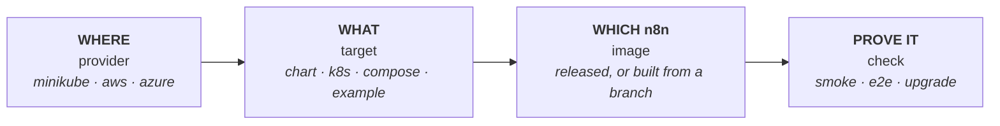
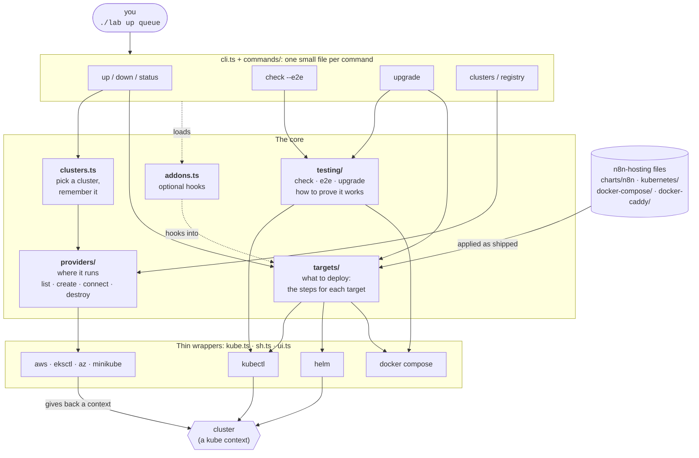
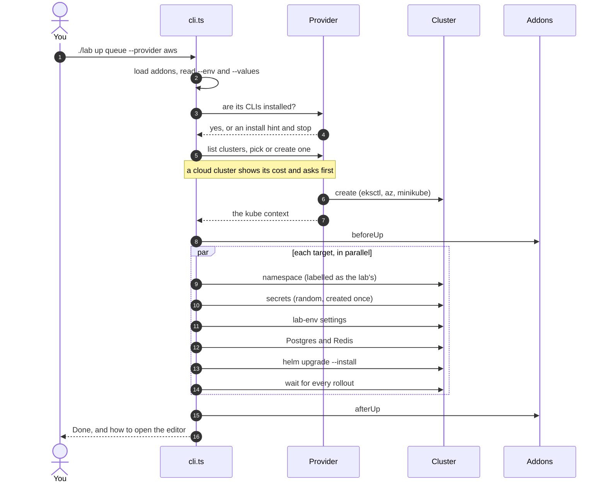

# 🧪 n8n hosting lab

**Deploy n8n the way the `n8n-hosting` files deploy it, on your laptop or a cloud, and prove it works.**

```bash
./lab up queue          # queue mode: main, workers, Postgres, Redis
./lab check --e2e       # health checks, then a real workflow run through a webhook
./lab down              # clean up
```

> **Throwaway by design.** Lab deployments use disposable storage, random secrets and ClusterIP services. They are for testing, never for production.

---

## Contents

1. [Why this exists](#-why-this-exists)
2. [Quick start](#-quick-start)
3. [The big idea](#-the-big-idea)
4. [Architecture](#%EF%B8%8F-architecture)
5. [What happens on `./lab up`](#-what-happens-on-lab-up)
6. [Using it](#-using-it): targets, providers, clusters, checks, upgrades, images
7. [How it is structured](#%EF%B8%8F-how-it-is-structured)
8. [Extending it](#-extending-it): a target, a provider, a check, an addon
9. [Safety rules](#%EF%B8%8F-safety-rules)
10. [Settings and troubleshooting](#%EF%B8%8F-settings-and-troubleshooting)

---

## 💡 Why this exists

`n8n-hosting` ships several ways to run n8n: a Helm chart, plain Kubernetes manifests, Docker Compose stacks, and chart examples. Each one is a product people depend on, and each one can break in ways a template render or a lint never shows: a pod that never becomes ready, a database migration that fails on upgrade, a webhook processor that cannot reach Redis.

The lab answers one question for any of them: **does this actually run?**

- It deploys the files **as shipped**. It does not keep its own copy of the chart or the manifests, so what it tests is what you would ship.
- It runs on **real clusters**: minikube on your laptop, or EKS and AKS when you need a cloud.
- It tests **behaviour**, not just syntax: pods ready, health, database reachable, the editor loads, a workflow runs, an upgrade keeps your data.
- It is **one command per job**, so a reviewer can verify a chart change in minutes instead of reading about it.

---

## ⚡ Quick start

You need Node 24 or later, `kubectl`, `helm`, and a cluster provider (minikube with Docker is the easy one).

```bash
cd tools/lab
pnpm install                    # once

./lab up single                 # one pod with SQLite: the smallest thing that runs
./lab status                    # what is running
./lab check --e2e               # prove it works

./lab down                      # remove every deployment (the cluster stays)
```

To open the editor, `up` prints a ready-made `kubectl port-forward` line.

Missing a tool? The lab stops before it creates anything and tells you what to install.

| I want to... | Run |
| --- | --- |
| Test a Helm chart change | `HOSTING=<worktree> ./lab up queue` |
| Test the `kubernetes/` manifests | `./lab up k8s` |
| Test a Compose stack | `./lab up compose-with-postgres` |
| Test a chart example | `./lab up example-minimal` |
| Test an unreleased n8n branch | [build an image](#test-an-unreleased-n8n-branch), then `N8N_IMAGE=... ./lab up k8s` |
| Check an upgrade keeps working | `./lab upgrade queue --from 2.30.0` |
| Run on a cloud | `./lab up queue --provider aws` (or `azure`) |
| Try an n8n setting | `./lab up queue --env N8N_LOG_LEVEL=debug` |

`./lab --help` lists every command, target and setting.

---

## 🧠 The big idea

Every run is the combination of **four independent choices**. Change one without touching the others.



| Choice | Picked by | Examples |
| --- | --- | --- |
| **Where** it runs | `--provider` | `minikube`, `aws`, `azure` |
| **What** is deployed | the target name | `single`, `queue`, `k8s`, `compose-caddy`, `example-minimal` |
| **Which n8n** code | `N8N_IMAGE`, `N8N_TAG` | the version the files ship with, `nightly`, an image built from your branch |
| **What proves it** | the command | `check`, `check --e2e`, `upgrade` |

There is a fifth, quieter choice: *which files*. `HOSTING` points at the checkout or worktree holding the chart, manifests and Compose files. By default that is this repository.

---

## 🏗️ Architecture

The lab is a small TypeScript CLI that drives tools you already have (`kubectl`, `helm`, `docker`, and a cloud CLI). There is no server, no database and no build step. Node 24 runs the TypeScript directly.



Three ideas hold it together:

1. **A provider only hands back a kube context.** Everything after that (deploying, checking, upgrading) is identical on every provider.
2. **A target is a list of steps.** Namespace, secrets, settings, Helm install, wait. The same steps run for a fresh install and for an upgrade, so the upgrade test reuses them instead of re-implementing them.
3. **Tests run inside the pods.** Checks use `kubectl exec` (or `docker exec`) and talk to n8n on `localhost:5678`, so no port is published and no ingress or firewall is involved.

---

## 🎬 What happens on `./lab up`



Rerunning `up` is safe: secrets are created once (so an encryption key never changes under a running install) and Helm upgrades in place.

---

## 🧰 Using it

### Targets

| Target | What it deploys | Runs on |
| --- | --- | --- |
| `single` | Helm chart, one pod, SQLite | any provider |
| `queue` | Helm chart, main, 2 workers, Postgres, Redis | any provider |
| `webhooks` | `queue` plus 2 webhook processors | any provider |
| `multimain` | `webhooks` plus multi-main. Needs `N8N_LICENSE_KEY` (Enterprise) | any provider |
| `k8s` | the `kubernetes/` manifests | any provider |
| `compose-with-postgres` | `docker-compose/withPostgres` | local Docker (minikube provider) |
| `compose-with-postgres-and-worker` | `docker-compose/withPostgresAndWorker` | local Docker (minikube provider) |
| `compose-caddy` | `docker-caddy`, the `n8n` service only | local Docker (minikube provider) |
| `compose-subfolder-with-ssl` | `docker-compose/subfolderWithSSL`, the `n8n` service only | local Docker (minikube provider) |
| `example-<name>` | `charts/n8n/examples/<name>.yaml` | any provider |

- `./lab up` with no target runs `single queue webhooks multimain`. Name several to run them side by side: `./lab up k8s queue`.
- **Chart targets** install the chart with the topology set by `--set` flags, then lay `values/common.yaml` over it (small requests so four installs fit on one node, and the lab's own Postgres and Redis).
- **`k8s`** applies the manifests with two in-memory changes: the namespace becomes `lab-k8s` so a real install is never touched, and the Deployment gets the lab settings.
- **Compose** runs the files as shipped. A generated override in `.compose/` adds the lab settings and frees the host port so stacks run side by side. The proxy in the Caddy and subfolder stacks is not started.
- **`example-<name>`** deploys a chart example as shipped, creates every secret it names with random values, and turns autoscalers off. If an example needs something the cluster lacks (KEDA, labelled nodes, a licence key), the lab stops in seconds and says how to fix it.

### Providers

| Provider | Needs | Cost | Notes |
| --- | --- | --- | --- |
| `minikube` (default) | `minikube`, `docker` | free | Runs every target. Wants 8 GiB or more |
| `aws` | `aws`, `eksctl` | about $0.20 an hour | EKS, 1 × t3.large. Chart and `k8s` targets |
| `azure` | `az` | about $0.08 an hour | AKS, 1 × Standard_B2ms, in its own resource group. Chart and `k8s` targets |

```bash
./lab up queue --provider aws         # lists your clusters, or creates one (asks first)
./lab down --provider aws             # removes deployments. The cluster stays, and keeps costing
./lab cluster delete lab-<you> --provider aws
```

A cloud cluster keeps costing until you delete it. `./lab status` shows how long it has run and what it costs.

### Clusters

A cluster outlives its deployments, so you can tear deployments down and redo them on the same cluster.

| Command | What it does |
| --- | --- |
| `./lab up` | lists your clusters, lets you pick one or create one |
| `./lab up --cluster <name>` | uses that cluster, or creates it |
| `./lab clusters` | lists the clusters for the provider |
| `./lab status` | the current cluster, its pods, and what it costs |
| `./lab down` | removes deployments, keeps the cluster |
| `./lab cluster delete <name>` | destroys a cluster and everything in it. Asks first |

### Checks

```bash
./lab check            # every deployed target
./lab check queue k8s  # only these
./lab check --e2e      # also run a workflow
```

| Check | Passes when |
| --- | --- |
| Pods ready | every deployment is Available (cluster targets) |
| Health | `/healthz` answers 200 |
| Readiness | `/healthz/readiness` answers 200, so n8n reached its database |
| Editor loads | `/` answers 200 with the n8n page |
| Webhook route answers | `/webhook/...` answers 404 from n8n (from a webhook processor when there is one) |
| **`--e2e`**: workflow runs | a workflow is created, its webhook is called, and the result it computed comes back |

Each check retries for about 20 seconds, so it is safe to run right after `up`. The command exits 1 when anything fails.

**What `--e2e` does.** Inside the pod it creates an owner (`lab-e2e@example.com`, with a password derived from the install's own encryption key, so nothing is passed on a command line), creates a webhook workflow, calls the webhook, checks the answer contains a random value it sent, and deletes the workflow. In queue mode that proves a worker really ran the job. It needs a recent n8n.

### Upgrade test

Most real installs break when they upgrade, on a database migration. This tests it:

```bash
./lab upgrade queue --from 2.30.0                  # up to the version the files ship with
./lab upgrade queue --from 2.30.0 --to 2.40.0
```

It installs `--from`, checks it, saves a marker workflow, upgrades, checks again, and confirms the marker survived. The target must not exist yet, so it always starts from a clean install.

### Test an unreleased n8n branch

```bash
pnpm --filter <package> build                      # in your n8n worktree
./build-image.sh ~/git/n8n-wt-my-branch my-branch
N8N_IMAGE=n8n-my-branch N8N_TAG=latest ./lab up k8s
```

`build-image.sh` copies the branch's compiled files over a `nightly` image, so it takes seconds, not a full image build. The branch must sit reasonably close to `nightly`. On a cloud, push to a registry the cluster can pull from: `./lab registry`.

### Generic settings

```bash
./lab up queue --env N8N_LOG_LEVEL=debug           # an extra n8n setting on every pod. Repeat it
./lab up queue --values my-values.yaml             # a Helm values file laid over the lab's own
```

n8n's own diagnostics are **off** in every lab deployment unless you turn them on with `--env`, so a lab never reports to n8n's servers.

---

## 🗺️ How it is structured

```
tools/lab/
├── lab                      # entry point: runs src/cli.ts
├── src/
│   ├── cli.ts               # reads options, picks the provider and cluster, runs one command
│   ├── options.ts           # command-line flags, parsed once into an Options object
│   ├── help.ts              # the --help text
│   ├── commands/            # one small file per command
│   │   ├── up.ts  down.ts  status.ts  check.ts  upgrade.ts  clusters.ts  registry.ts
│   ├── providers/           # where it runs
│   │   ├── types.ts         #   the Provider interface
│   │   ├── minikube.ts  eks.ts  aks.ts
│   │   ├── lab.ts           #   the lab tag, the owner, name rules shared by the clouds
│   │   └── index.ts         #   getProvider, and the "is the CLI installed?" check
│   ├── targets/             # what gets deployed
│   │   ├── names.ts         #   target names, descriptions, namespaces
│   │   ├── chart.ts  example.ts  k8s.ts  compose.ts   # the steps for each kind of target
│   │   ├── steps.ts         #   helpers they share: secrets, Helm install, waiting
│   │   └── index.ts         #   targetTask, removal, "what is deployed now"
│   ├── testing/             # how it proves it works
│   │   ├── check.ts         #   smoke tests, and the retrying check() helper
│   │   ├── e2e.ts           #   the workflow test, and e2e-client.js which runs inside the pod
│   │   ├── upgrade.ts       #   install old, upgrade, check
│   │   └── exec.ts  retry.ts
│   ├── kube.ts              # the Env, and kubectl and helm wrappers
│   ├── namespaces.ts        # the lab's label, listing and removing its namespaces
│   ├── settings.ts          # the n8n settings written into every deployment
│   ├── clusters.ts          # choosing a cluster, remembering it in .lab-state.json
│   ├── chart-examples.ts    # reads chart examples, finds their secrets and licence needs
│   ├── addons.ts            # the addon hooks
│   ├── failures.ts  tasks.ts  sh.ts  ui.ts
├── test/                    # unit tests: pnpm test
├── values/common.yaml       # Helm values shared by every chart target
├── manifests/               # Postgres and Redis for the chart targets
├── build-image.sh           # builds an image from an n8n branch
└── AGENTS.md                # for AI agents working on the lab
```

**How the pieces talk.** `cli.ts` reads the options, picks a **provider** and a cluster, and hands one **command** an `Env`: where it runs, which cluster, what to deploy from. A command builds a list of **tasks** from **targets** or **testing** and runs them with [listr2](https://listr2.kilic.dev/) for the progress display. Everything reaches the cluster through `kube.ts`, which refuses to run `kubectl` or `helm` without an explicit context, so the lab can never act on whatever cluster happens to be current.

**One rule about failures.** listr2 does not fail the top-level run when a subtask fails, so every step and check records its failure with `recordFailure(target, step)` (`failures.ts`), and the command turns the list into the exit code. The helpers in `targets/steps.ts` and `testing/check.ts` do it for you. Keep using them for new steps.

**Small, testable functions.** Anything that decides something is a pure function with no cluster in sight (`composeOverride`, `sized`, `storageClassToDefault`, `runningFor`, and so on), and `pnpm test` covers them. The functions that talk to a cluster stay thin.

---

## 🔧 Extending it

### Add a target

A target is a name plus a list of steps. They live in `src/targets/`.

1. **A new Helm topology** is one line: add its `--set` values to `TOPOLOGY` in `chart.ts`, and its name to `CHART_TARGETS` in `names.ts`.
2. **Something else** gets its own file with a function that returns steps, like `k8s.ts`. Wire it into `stepsFor` in `targets/index.ts`.
3. Add a one-line description to `DESCRIPTION` in `names.ts`, so it shows in `--help`.
4. Make sure `testing/exec.ts` can reach it (`execFor`).

Build steps with the helpers in `steps.ts` (`step`, `ensureChartSecrets`, `helmInstall`, `waitForRollouts`). They create secrets once, set Helm values in the right order and record failures for you.

### Add a provider

A provider lists, creates, connects to and destroys named clusters. It only has to give back a kube context. Add `src/providers/<name>.ts` and register it in `providers/index.ts`:

```ts
interface Provider {
  name: string;
  local: boolean;                  // local providers can use loaded images and run Compose
  shared?: boolean;                // the cluster list may hold clusters that are not the lab's
  clis: string[];                  // checked before anything is created, with an install hint
  defaultName(): string;
  list(): Promise<Cluster[]>;      // only the lab's own clusters (check the lab tag)
  create(name, log): Promise<void>;
  connect(name): Promise<string>;  // returns the kube context
  destroy(name, log): Promise<void>;
  plan?(name): Promise<string>;    // shown before a cloud cluster is created: cost and time
  info?(name): Promise<string>;    // shown by `status`: how long it has run, what it costs
  registry?: { ensure; remove };   // a registry the cluster can pull from
}
```

Rules a cloud provider follows: tag everything with the lab tag (`providers/lab.ts`), list and delete only clusters that carry it, put the provider name in the kube context (`aws-<name>`), and never delete anything in `down`. Add an install hint for its CLI in `providers/index.ts`.

### Add a check

Use the `checker` helper in `src/testing/check.ts`. It retries, and it records a failure so the exit code is right:

```ts
const check = checker(target);
check('Metrics endpoint answers', () => expectStatus(main, '/metrics', 200))
```

### Add a command

Write `src/commands/<name>.ts` exporting a `Command` (`(env, args, opts) => Promise<void>`), add it to `STANDALONE` or `ON_CLUSTER` in `cli.ts`, and a line to `help.ts`.

### Write an addon

An addon adds something the lab does not know about: extra n8n settings, extra things to deploy, extra commands. It is one file:

```ts
// my-addon/index.ts
import type { Addon, LabApi } from '<path to the lab>/src/addons.ts';

export default function (lab: LabApi): Addon {
  return {
    name: 'my-addon',
    // extra n8n settings for each target. `source` is the target, `compose` says it runs in Docker
    env: ({ source }) => ({ N8N_LOG_LEVEL: 'debug' }),
    // deploy something before the targets run
    beforeUp: async (env, log) => { await lab.ensureNs(env, 'lab-my-addon', 'my-addon'); },
    // clean up when `./lab down` runs with no target
    afterDown: async (env, all, log) => { if (all) await lab.removeNamespaces(env, ['lab-my-addon'], log); },
    // new commands: ./lab hello
    commands: { hello: { help: 'say hello', run: async () => console.log('hello') } },
  };
}
```

```bash
./lab up queue --addon ./my-addon        # a folder or a file anywhere
LAB_ADDONS=./my-addon ./lab up queue     # or every time
./lab --addon ./my-addon --help          # its commands show up in the help
```

Every hook is optional (`env`, `beforeUp`, `afterUp`, `afterDown`, `commands`). `lab` hands an addon `kubectl`, `apply`, `ensureNs`, `exists`, `removeNamespaces`, `run`, the terminal helpers and `ROOT`; see `src/addons.ts`. Pass the addon's name to `ensureNs` so its namespace is not mistaken for a target.

---

## 🛡️ Safety rules

The lab is meant to be pointed at accounts and machines with real things in them, so it is careful.

| Rule | How |
| --- | --- |
| **Never touches a cluster it was not told to** | `kubectl` and `helm` refuse to run without an explicit context |
| **Only removes what it created** | every namespace carries `app.kubernetes.io/managed-by=n8n-hosting-lab`, and `down` only deletes labelled ones, whatever their name |
| **Never deletes a cluster that is not its own** | AWS and Azure clusters must carry the `lab=n8n-hosting-lab` tag to be listed or deleted. minikube lists every profile, so deleting one needs its name typed |
| **Cloud means cost, so it asks** | creating a cluster shows the plan and asks. `down` never deletes a cluster. `status` shows what a running one costs |
| **Secrets stay off command lines** | they travel on stdin or from the environment, and are never printed. Keys are random and created once |
| **Never writes to the files it deploys** | the chart, manifests and Compose files are applied as shipped. Changes happen in memory or in a generated override |
| **Nothing phones home** | n8n diagnostics are off in every lab deployment |
| **A missing tool is an error** | with an install hint, before anything is created. It never silently falls back |

---

## ⚙️ Settings and troubleshooting

| Variable | What it does | Default |
| --- | --- | --- |
| `HOSTING` | the checkout to deploy from | the repo the lab sits in, else `~/git/n8n-hosting` |
| `CHART` | path to the chart | `$HOSTING/charts/n8n` |
| `N8N_IMAGE`, `N8N_TAG` | the image to deploy. On a cloud it must be in a registry | what the files ship with |
| `N8N_LICENSE_KEY` | Enterprise key for `multimain` and licensed examples | asked for, Enter skips it |
| `LAB_PROVIDER` | default provider | `minikube` |
| `LAB_ADDONS` | addons to load, separated by colons | none |
| `AWS_REGION` | AWS region | the AWS CLI config |
| `AZURE_LOCATION` | Azure region | the Azure CLI config |
| `LAB_AWS_NODE_TYPE`, `LAB_AWS_NODES` | EKS node type and count | `t3.large`, 1 |
| `LAB_AZURE_NODE_SIZE`, `LAB_AZURE_NODES` | AKS node size and count | `Standard_B2ms`, 1 |

**Common snags**

- **`up` waits on a licence question.** Set `N8N_LICENSE_KEY`, or run with `</dev/null` to skip licensed targets.
- **`kubectl` is refused (local).** Start your Docker runtime and minikube, for example `colima start && minikube start`.
- **minikube has too little memory.** The lab needs about 6 GiB, and `up` wants 8 or more. It prints the `docker update` command that fixes it.
- **A Compose target fails on `!override`.** The generated override needs Docker Compose 2.24 or later.
- **An example needs KEDA or labelled nodes.** The lab stops early and prints the command to install or label.
- **A cloud cluster is still running.** `./lab status --provider aws`, then `./lab cluster delete <name> --provider aws`.

Check types with `pnpm typecheck` and run the unit tests with `pnpm test`. Working on the lab with an AI agent: see [AGENTS.md](AGENTS.md).

