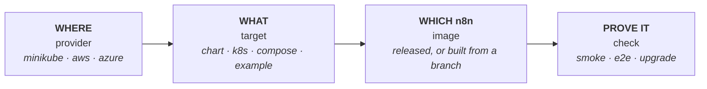

# 🧪 n8n hosting lab

**Deploy n8n the way the `n8n-hosting` files deploy it, on your laptop or a cloud, and prove it works.**

```bash
./lab up queue          # queue mode: main, workers, Postgres, Redis
./lab check --e2e       # health checks, then a real workflow run through a webhook
./lab down              # clean up
```

> **Throwaway by design.** Lab deployments use disposable storage, random secrets and ClusterIP services. They are for testing, never for production.

**Docs:** [Architecture](docs/architecture.md) · [Extending](docs/extending.md) · [Reference](docs/reference.md)

---

## 💡 Why

`n8n-hosting` ships several ways to run n8n: a Helm chart, Kubernetes manifests, Compose stacks and chart examples. Each can break in ways a lint never shows: a pod that never becomes ready, a migration that fails on upgrade, a webhook processor that cannot reach Redis.

The lab answers one question for any of them: **does this actually run?**

- It deploys the files **as shipped**, never its own copy, so it tests what you would ship.
- It runs on **real clusters**: minikube, or EKS and AKS when you need a cloud.
- It tests **behaviour**: pods ready, database reachable, a workflow runs, an upgrade keeps your data.
- It is **one command per job**, so a reviewer can verify a chart change in minutes.

---

## ⚡ Quick start

You need Node 24 or later, `kubectl`, `helm`, and minikube with Docker for the easy local setup.

```bash
cd tools/lab
pnpm install                    # once

./lab up single                 # one pod with SQLite: the smallest thing that runs
./lab check --e2e               # prove it works
./lab down                      # remove every deployment (the cluster stays)
```

`up` prints a `kubectl port-forward` line to open the editor. Missing a tool? The lab stops before it creates anything and says what to install.

| I want to... | Run |
| --- | --- |
| Test a Helm chart change | `HOSTING=<worktree> ./lab up queue` |
| Test the `kubernetes/` manifests | `./lab up k8s` |
| Test a Compose stack | `./lab up compose-with-postgres` |
| Test a chart example | `./lab up example-minimal` |
| Check an upgrade keeps working | `./lab upgrade queue --from 2.30.0` |
| Test an unreleased n8n branch | [build an image](docs/reference.md#test-an-unreleased-n8n-branch), then `N8N_IMAGE=... ./lab up k8s` |
| Run on a cloud | `./lab up queue --provider aws` (or `azure`) |
| Try an n8n setting | `./lab up queue --env N8N_LOG_LEVEL=debug` |

`./lab --help` lists every command, target and setting.

---

## 🧠 How it fits together

Every run is **four independent choices**. Change one without touching the others.



The lab is a small TypeScript CLI that drives tools you already have (`kubectl`, `helm`, `docker`, a cloud CLI). No server, no database, no build step. A provider only has to hand back a kube context, and everything after that is the same on every provider. [Architecture](docs/architecture.md) has the layers, the folder map and the flow of `./lab up`.

---

## ☁️ Where it runs

| Provider | Needs | Cost | Notes |
| --- | --- | --- | --- |
| `minikube` (default) | `minikube`, `docker` | free | Runs every target. Wants 8 GiB or more |
| `aws` | `aws`, `eksctl` | about $0.20 an hour | EKS, 1 × t3.large. Chart and `k8s` targets |
| `azure` | `az` | about $0.08 an hour | AKS, 1 × Standard_B2ms. Chart and `k8s` targets |

A cloud cluster keeps costing until you delete it with `./lab cluster delete <name>`. `down` removes deployments only, `status` shows what a running cluster costs, and creating one always asks first.

---

## 🎯 What it deploys

| Target | What it deploys |
| --- | --- |
| `single` | Helm chart, one pod, SQLite |
| `queue` | Helm chart, main, 2 workers, Postgres, Redis |
| `webhooks` | `queue` plus 2 webhook processors |
| `multimain` | `webhooks` plus multi-main (needs `N8N_LICENSE_KEY`) |
| `k8s` | the `kubernetes/` manifests |
| `compose-with-postgres`, `compose-with-postgres-and-worker`, `compose-caddy`, `compose-subfolder-with-ssl` | the Compose stacks (minikube provider only) |
| `example-<name>` | any file in `charts/n8n/examples/` |

`./lab up` with no target runs `single queue webhooks multimain`. Name several to run them side by side. [Reference](docs/reference.md#targets) has the details.

---

## ✅ How it proves it works

`./lab check` smoke-tests every deployed target from inside its pods, so no port is published:

**pods ready** · **health** · **database reachable** · **editor loads** · **webhook route answers**

`./lab check --e2e` goes further: it creates a webhook workflow, calls it, and checks the answer it computed. On `queue` that proves a worker really ran the job. `./lab upgrade queue --from <version>` installs an old version, upgrades it, and checks nothing broke, including your data. [Reference](docs/reference.md#checks) has every check.

---

## 🛡️ Careful by default

The lab is meant to be pointed at accounts and machines with real things in them. It only deletes what it created (namespaces carry a label, clouds a tag), never touches a cluster you did not name, keeps secrets off command lines, and turns n8n's diagnostics off. [The full list](docs/reference.md#safety-rules).

---

## 📚 Learn more

| | |
| --- | --- |
| [Architecture](docs/architecture.md) | the layers, the one rule, the `up` flow, the folder map |
| [Extending](docs/extending.md) | add a target, provider, check, command or addon |
| [Reference](docs/reference.md) | every target, command, setting, rule and common snag |
| [AGENTS.md](AGENTS.md) | for AI agents working on the lab |

