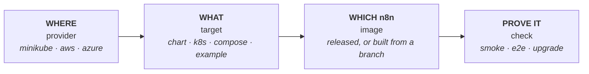
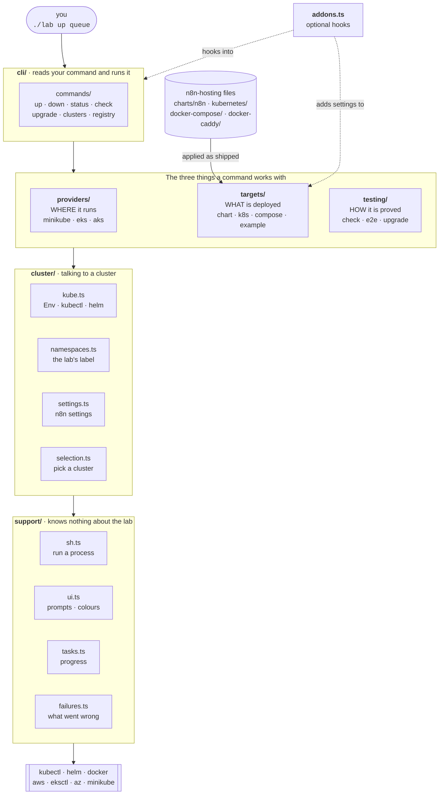
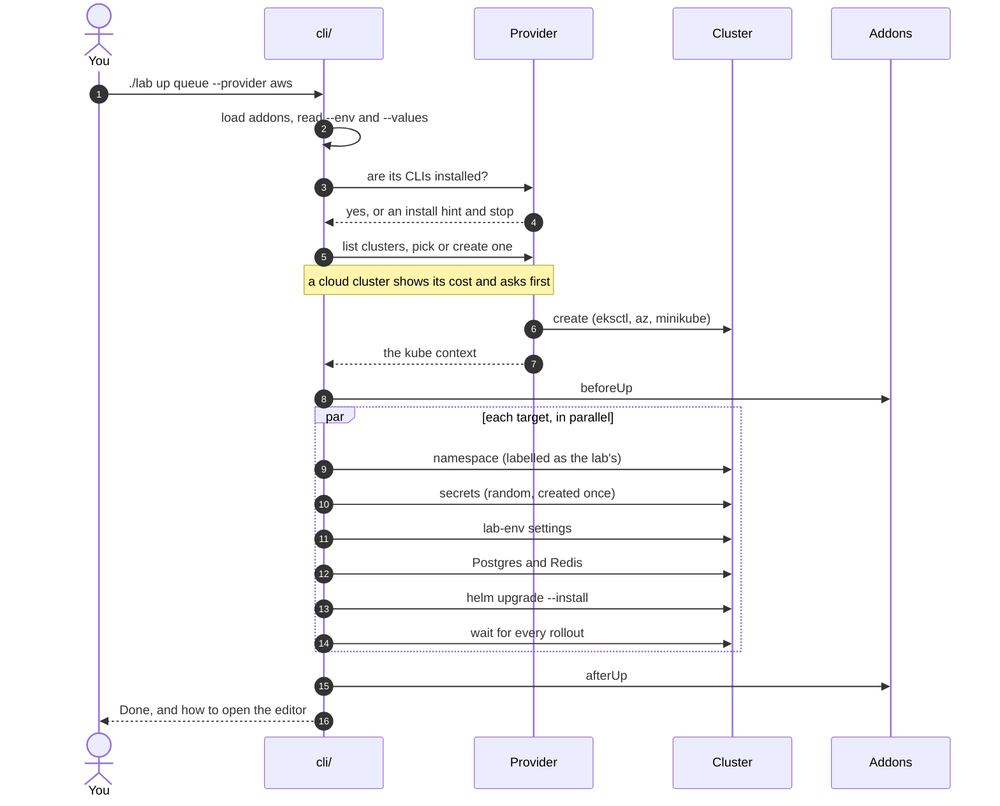

# Architecture

How the lab is built, and why. For using it, start with the [README](../README.md). To add something, see [Extending](extending.md).

**Contents:** [The four choices](#the-four-choices) · [The layers](#the-layers) · [What happens on `./lab up`](#what-happens-on-lab-up) · [How it is structured](#how-it-is-structured)

---

## The four choices

Every run is the combination of **four independent choices**. Change one without touching the others.



There is a fifth, quieter choice: *which files*. `HOSTING` points at the checkout or worktree holding the chart, manifests and Compose files. By default that is the repository the lab sits in.

---

## The layers

The lab is a small TypeScript CLI that drives tools you already have (`kubectl`, `helm`, `docker`, and a cloud CLI). There is no server, no database and no build step. Node 24 runs the TypeScript directly.

It is built in **layers**. A command sits on top, works with three things (a provider, a target, a test), and everything underneath talks to the cluster through one small layer.



### The one rule

**A layer only imports from the layers below it.** Lower layers know nothing about higher ones, so you can change a provider without touching a command, and add a command without touching a provider. `test/architecture.test.ts` fails if someone breaks it.

| Layer | Job | May use |
| --- | --- | --- |
| `cli/` | read the command line, pick a provider and a cluster, run one command | everything below |
| `testing/` | prove a deployment works: smoke checks, the workflow test, the upgrade test | `targets`, `cluster`, `support` |
| `targets/` | what each target deploys, as a list of steps | `cluster`, `support` |
| `providers/` | create, find, connect to and destroy clusters | `support` |
| `cluster/` | the `Env`, `kubectl` and `helm`, the lab's namespace label, the n8n settings, choosing a cluster | `support` |
| `support/` | run a process, prompt, show progress, record failures | nothing |
| `addons.ts` | the hooks an addon plugs into | `cluster`, `support` |

### Three ideas hold it together

1. **A provider only hands back a kube context.** Everything after that (deploying, checking, upgrading) is identical on every provider.
2. **A target is a list of steps.** Namespace, secrets, settings, Helm install, wait. The same steps run for a fresh install and for an upgrade, so the upgrade test reuses them instead of re-implementing them.
3. **Tests run inside the pods.** Checks use `kubectl exec` (or `docker exec`) and talk to n8n on `localhost:5678`, so no port is published and no ingress or firewall is involved.

---

## What happens on `./lab up`



Rerunning `up` is safe: secrets are created once (so an encryption key never changes under a running install) and Helm upgrades in place.

---

## How it is structured

```
tools/lab/
├── lab                         # entry point: runs src/cli/index.ts
├── src/
│   ├── cli/                    # reads your command, runs it
│   │   ├── index.ts            #   picks the provider and cluster, dispatches to one command
│   │   ├── options.ts          #   command-line flags, parsed once into an Options object
│   │   ├── help.ts             #   the --help text
│   │   └── commands/           #   one small file per command
│   │       └── up  down  status  check  upgrade  clusters  registry
│   ├── testing/                # how it proves things work
│   │   ├── check.ts            #   smoke tests, and the retrying checker()
│   │   ├── e2e.ts              #   the workflow test
│   │   ├── e2e-client.js       #   ...and the script it runs inside the pod
│   │   ├── upgrade.ts          #   install old, upgrade, check
│   │   └── exec.ts  retry.ts   #   run a command in a pod, retry
│   ├── targets/                # what gets deployed
│   │   ├── names.ts            #   target names, descriptions, namespaces
│   │   ├── chart.ts  example.ts  k8s.ts  compose.ts    # the steps for each kind of target
│   │   ├── steps.ts            #   helpers they share: secrets, Helm install, waiting
│   │   ├── chart-examples.ts   #   reads charts/n8n/examples
│   │   └── index.ts            #   targetTask, removal, "what is deployed now"
│   ├── providers/              # where it runs
│   │   ├── types.ts            #   the Provider interface
│   │   ├── minikube.ts  eks.ts  aks.ts
│   │   ├── lab.ts              #   the lab tag, owner and name rules the clouds share
│   │   └── index.ts            #   getProvider, and the "is the CLI installed?" check
│   ├── cluster/                # talking to a cluster
│   │   ├── kube.ts             #   the Env, kubectl, helm, secrets, storage class
│   │   ├── namespaces.ts       #   the lab's label, listing and removing its namespaces
│   │   ├── settings.ts         #   the n8n settings written into every deployment
│   │   └── selection.ts        #   choosing a cluster, remembering it in .lab-state.json
│   ├── support/                # no lab knowledge
│   │   └── sh.ts  ui.ts  tasks.ts  failures.ts
│   └── addons.ts               # the addon hooks
├── test/                       # unit tests (pnpm test), and the layering test
├── values/common.yaml          # Helm values shared by every chart target
├── manifests/                  # Postgres and Redis for the chart targets
├── build-image.sh              # builds an image from an n8n branch
└── AGENTS.md                   # for AI agents working on the lab
```

**How a command runs.** `cli/index.ts` reads the options, picks a **provider** and a cluster, and hands one **command** an `Env`: where it runs, which cluster, what to deploy from. The command builds a list of **tasks** from `targets/` or `testing/` and runs them with [listr2](https://listr2.kilic.dev/) for the progress display. Everything reaches the cluster through `cluster/kube.ts`, which refuses to run `kubectl` or `helm` without an explicit context, so the lab can never act on whatever cluster happens to be current.

**Patterns used throughout**

- **No globals.** The `Env` is passed to whatever needs it. The selected cluster and its kube context live on it.
- **Functions that decide are pure.** The Compose override, Postgres sizing, name rules, the settings merge and retry take values and return values, with no cluster in sight, so `pnpm test` covers them. The functions that talk to a cluster stay thin.
- **One module per variation.** One file per provider, per kind of target and per command, so adding one does not mean editing a big file.
- **One rule about failures.** listr2 does not fail the top-level run when a subtask fails, so every step and check records its failure with `recordFailure(target, step)` (`support/failures.ts`) and the command turns the list into the exit code. The helpers in `targets/steps.ts` and `testing/check.ts` do it for you. Keep using them for new steps.
- **Never a shell string.** Processes are started with an argument list (`support/sh.ts`), so nothing a user types is ever interpreted by a shell. Secrets travel on stdin.
